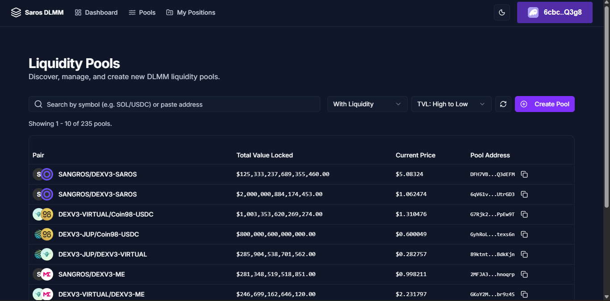

Saros DLMM UI: Advanced Liquidity Position Manager

An advanced, feature-rich interface for creating and managing concentrated liquidity positions on the Solana blockchain, built on the powerful Saros Dynamic Liquidity Market Maker (DLMM) SDK. This Next.js application provides a seamless, high-performance user experience for liquidity providers to maximize their capital efficiency.

https://saros-toolkit.netlify.app/

✨ Key Features
This application is more than just a simple UI; it's a complete toolkit for serious liquidity providers.
📈 Portfolio Dashboard: Get an at-a-glance overview of your total positions, active positions, SOL balance, and estimated portfolio value.
🌊 Comprehensive Pool Management:
View a list of all available liquidity pools.
Filter pools with active liquidity or view all pools.
Sort pools by Total Value Locked (TVL).
Search for pools by token pair or by pasting the pool address directly.
Create brand new liquidity pools with a custom bin step and initial price.
💼 Detailed Position Management:
Drill down into individual pool details to view reserves, current price, and your positions within that pool.
Add new liquidity to any pool with a sophisticated UI, including price range sliders and balance checks.
🔍 Advanced Position Scanning:
Fast Scan: Instantly loads your positions from a local cache for a snappy UX.
Scan Active Pools: Intelligently scans only pools with meaningful liquidity to find your positions quickly.
Scan Inactive Pools: A deeper scan for positions in pools that may have zero liquidity.
Full Rescan: A comprehensive, chain-wide scan to find every single one of your positions.
🔧 Granular Position Actions:
Remove Liquidity: Easily withdraw your funds from a position.
Rebalance: Adjust the price range of your position to adapt to market conditions.
Burn NFT: Securely burn the Position NFT for empty positions to clean up your wallet.
🌙 Modern Tech & UX:
Built with the Next.js 14 App Router.
Sleek and responsive UI built with Tailwind CSS and shadcn/ui.
Dark Mode & Light Mode support.
Resilient wallet connection logic with a modern loading skeleton to prevent UI flashes and redirect loops.

🛠️ Technology Stack
Framework: Next.js (App Router)
Language: TypeScript
Blockchain Integration:
@solana/web3.js
@solana/wallet-adapter-react
@saros-finance/dlmm-sdk
UI & Styling:
React
Tailwind CSS
shadcn/ui
Lucide React (Icons)
Framer Motion (Animations)
Deployment: Netlify

🏛️ Architectural Highlights
Resilient Authentication Flow: The primary layout for the dashboard (src/app/(dashboard)/layout.tsx) implements a robust, two-factor verification (isWalletChecked and isMinTimePassed) to handle wallet state. This completely eliminates the redirect race condition common in dApps and provides a smooth, professional loading experience for the user.
Performance-First Caching: The application intelligently uses sessionStorage to cache data that is expensive to fetch, such as the full list of pools and user positions. This dramatically speeds up navigation and reduces the number of RPC calls, resulting in a faster UI and lower costs.
Modular & Type-Safe Components: Built with TypeScript and organized into logical, reusable components (PoolList, PositionCard, AddLiquidity, etc.). This makes the codebase clean, maintainable, and easy to extend.
Route Groups for Layouts: Utilizes Next.js App Router's Route Groups (dashboard) to apply a consistent, protected layout to all core application pages without affecting the URL structure.

💡 Future Improvements
Real-time Data with WebSockets: Implement a WebSocket connection to the RPC endpoint to get real-time updates on prices and pool reserves.
Transaction History: Add a dedicated page or modal to show a history of the user's recent transactions (add/remove liquidity, etc.).
Performance Analytics: Display analytics for each position, such as fees earned, impermanent loss, and historical APR.
UI Notifications: Use a library like react-hot-toast to provide users with feedback on their actions (e.g., "Transaction Submitted," "Liquidity Added Successfully").